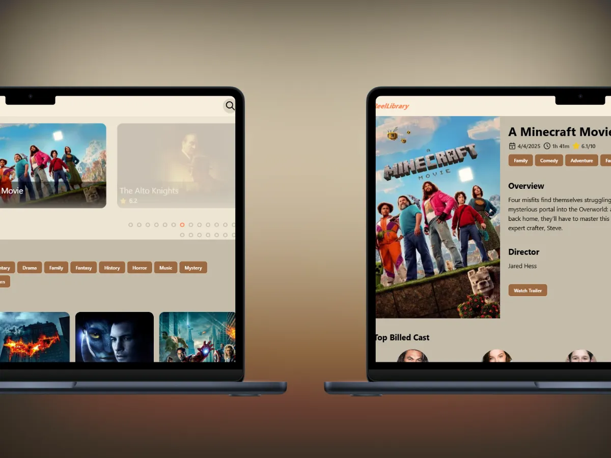
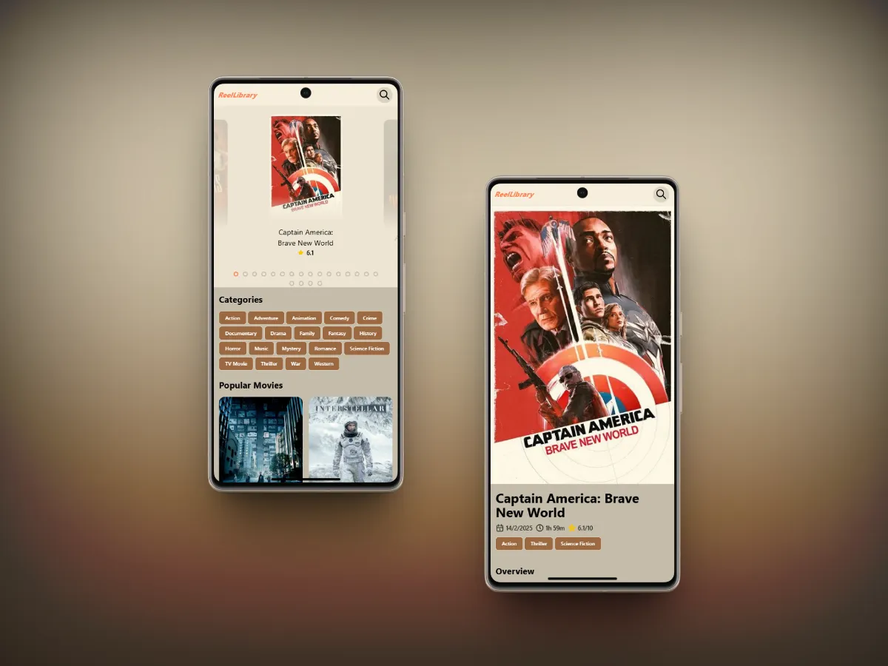

<a name="readme-top"></a>




# Reel Library 

Reel Library is a website for browsing movie reviews and trailers — a simple way to find the best movie to watch. It was developed during the <a href="https://platzi.com/cursos/api-practico/" target="_blank">Curso de API REST con Javascript: Ejemplos con APIs reales</a> on **Platzi**. The project demonstrates API consumption and DOM manipulation using JavaScript and TypeScript.

## Development

<div align="center">
  <a target="_blank" href="https://pagespeed.web.dev/analysis/https-reel-library-vercel-app/kmw7sopqq7?form_factor=desktop&category=performance&category=accessibility&category=best-practices&category=seo&hl=en-US&utm_source=lh-chrome-ext" target="_blank">
    Lighthouse Report
  </a>
</div>

In this project, I reached several milestones:

- First time using **Astro** for a web project. I learned how to use the **Environment Variables API Reference**, **Dynamic routes**, and **Creating Components**.
- Learning how to use **TypeScript**. Learning the basics of TypeScript, including types, and interfaces.
- Consuming the **TMDB API** to get movies, fetching data and updating the DOM dynamically based on API responses.
- Deploying the project on **Vercel**. I learned how to deploy a web application using Vercel, including setting up the project and configuring the environment variables.

## 🛠️ Technologies Used

- [Astro](https://astro.build/): A modern static site generator that allows you to build fast websites using components from various frameworks.
- [Tailwind CSS](https://tailwindcss.com/): To style the application quickly and efficiently.
- [JavaScript](https://developer.mozilla.org/en-US/docs/Web/JavaScript): For dynamic DOM manipulation and interaction.
- [TypeScript](https://www.typescriptlang.org/): A superset of JavaScript that adds static types, making the code more robust and maintainable.
<p align="right">(<a href="#readme-top">Back to top</a>)</p>

## Installation

1. Clone the repository to your local machine:

   ```bash
   git clone https://github.com/EdGonzz/reel-library.git
   ```

2. Navigate to the project directory:

   ```bash
   cd reel-library
   ```

3. Install the project dependencies:

   ```bash
   pnpm install
   ```

4. Create a `.env` file in the root directory and add your TMDB API key:

   ```bash
   API_TOKEN="your_api_key_here"
   ```

   Replace `your_api_key_here` with your actual TMDB API key.
   You can obtain an API key by signing up at [TMDB](https://www.themoviedb.org/documentation/api).
   Make sure to keep your API key secure and do not expose it in public repositories.
   You can also use the `.env.example` file as a template.
   In this project I use astro:env API to access the environment variables. If you want to know more about it, check the [Astro documentation](https://docs.astro.build/en/guides/environment-variables/#type-safe-environment-variables).

5. If you plan to modify the project, use the command `pnpm run dev` to start a development server.

<p align="right">(<a href="#readme-top">Back to top</a>)</p>

## Usage

Navigate to the project URL [here](https://reel-library.vercel.app/) to see the page in operation.

<p align="right">(<a href="#readme-top">Back to top</a>)</p>

## Contribution

1. Fork the project.
2. Create a new branch for your changes (`git checkout -b my-new-branch`)
3. Make your changes and commit (`git commit -am 'Add new feature'`)
4. Test your changes locally to ensure everything works as expected.
5. Push the branch (`git push origin my-new-branch`)
6. Open a Pull Request.
<p align="right">(<a href="#readme-top">Back to top</a>)</p>

## License

This project is licensed under the MIT License. See the [LICENSE](./LICENSE) file for more details.

<p align="right">(<a href="#readme-top">Back to top</a>)</p>

## Authors

- [Edwin Contreras](https://github.com/EdGonzz)
<p align="right">(<a href="#readme-top">Back to top</a>)</p>
